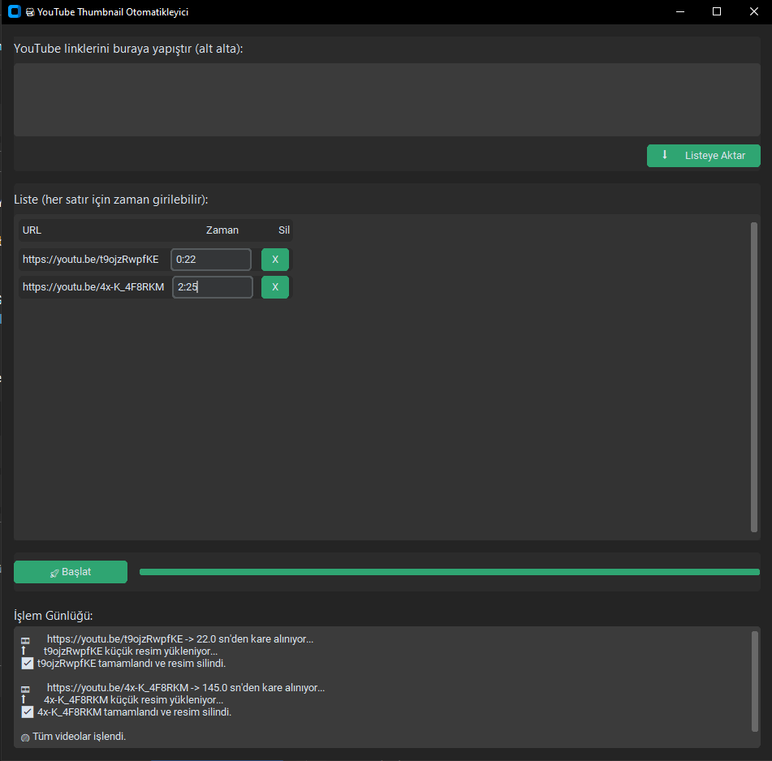

🎥 YouTube Thumbnail Auto Updater (Modern GUI + API + SEO Optimizer)

🧩 Proje Özeti
YouTube içerik üreticilerinin ve dijital ajansların video küçük resimlerini (thumbnails) profesyonel biçimde otomatik güncelleyebilmesi için geliştirilmiş bir araçtır. 
Videonun belirli saniyesinden kare alır, YouTube'a küçük resim olarak yükler ve gereksiz dosyaları temizler. 
Tüm işlem GUI üzerinden, kod bilgisi olmadan yapılır. Yetki yalnızca bir kez alınır (token.json). 
---

## 🖼️ Program Ekran Görüntüsü

---
💡 Kimler İçin Uygun?
- YouTube içerik üreticileri: Videolarına saniyeler içinde profesyonel küçük resim ekler.
- SEO uzmanları: Görsel optimizasyon sayesinde tıklanma oranlarını (CTR) artırır.
- Dijital ajanslar: Müşteri videolarını toplu biçimde optimize eder.
- Otomasyon geliştiricileri: YouTube Data API v3 kullanımını öğrenmek için örnek.
- Eğitim kurumları: Python + API + GUI entegrasyonu öğretmek için pratik örnek.

🚀 Neden Kullanılmalı?
- %95 zaman tasarrufu sağlar.
- Dinamik thumbnail seçimi (ör: 0:12, 2:57, 1:05:30).
- Akıllı yetkilendirme (token.json saklanır, tekrar login gerekmez).
- Otomatik temizlik (video ve jpg silinir).
- Modern “Metro” tasarım (responsive, koyu/yeşil tema).
- SEO katkısı: Optimize thumbnail ile CTR %20–30 artabilir.
- Çoklu video desteği, her satıra özel zaman.

🧰 Özellikler
- Dinamik tablo yapısı (her video satırına özel zaman girişi)
- Saat:Dakika:Saniye desteği (1:05:30, 0:57, 120)
- Modern CustomTkinter arayüzü
- Otomatik API token saklama (token.json)
- ffmpeg + yt-dlp entegrasyonu
- Progress bar + log sistemi
- Responsive Metro UI
- SEO uyumlu ve zaman kazandıran otomasyon

⚙️ Kurulum Rehberi

1️⃣ Python Kurulumu
Python 3.10 veya üstü sürüm kullanılmalıdır.
https://www.python.org/downloads/

2️⃣ Gerekli Kütüphaneler
pip install customtkinter google-api-python-client google-auth google-auth-oauthlib google-auth-httplib2 yt-dlp

3️⃣ ffmpeg Kurulumu
Windows: https://ffmpeg.org/download.html (PATH’e ekle)
macOS: brew install ffmpeg
Linux: sudo apt install ffmpeg

4️⃣ YouTube API (credentials.json) Alma
- Google Cloud Console’a git: https://console.cloud.google.com/
- Yeni proje oluştur → YouTube Data API v3 etkinleştir
- OAuth consent screen → External seç → bilgileri doldur
- Credentials → OAuth Client ID oluştur → “Desktop App” seç
- İndirilen credentials.json dosyasını proje klasörüne koy
İlk çalıştırmada tarayıcı açılır, izin verilir, token.json oluşur.

💻 Kullanım
1. python youtube_thumbnail_auto_updater.py komutu ile başlat.
2. Açılan pencerede YouTube linklerini kutuya yapıştır → Listeye Aktar.
3. Linkler tabloya düşer, her birinin yanında zaman kutusu vardır.
4. Zaman formatları: 12, 2:57, 1:05:30
5. Başlat 🚀 tuşuna bas → kare alınır, yüklenir, dosyalar silinir.
6. Log kutusundan ilerleme takip edilir.

📈 SEO ve Performans Etkisi
- Küçük resim hazırlama süresi: 2-3 dk → 5 sn
- API bağlantısı: Otomatik token kaydı
- SEO: Görsel + zaman bazlı thumbnail avantajı
- CTR artışı: Ortalama %20–30
- Operasyonel maliyet: Minimum

🧱 Dosya Yapısı
📂 youtube-thumbnail-auto-updater  
 ┣ 📜 youtube_thumbnail_auto_updater.py  
 ┣ 📜 credentials.json 
 ┣ 📜 token.json 
 ┗ 📜 README.txt 

📊 Örnek Ekran
──────────────────────────────────────────── 
📋 Yeni YouTube Linkleri: 
[ https://youtu.be/XTFAMfjp6Qo ] 
[ https://youtu.be/abcdEfG1234 ] 

📃 Liste: 
URL                              | Zaman  | ❌ 
──────────────────────────────────────────── 
https://youtu.be/XTFAMfjp6Qo      0:12 
https://youtu.be/abcdEfG1234      2:57 
──────────────────────────────────────────── 
🚀 Başlat | Progress Bar | Log 
──────────────────────────────────────────── 

🧠 Sık Sorulan Sorular
- API yetkisi yalnızca ilk seferde sorulur.
- Her video için farklı saniye girilebilir.
- Desteklenen zaman formatları: saniye, dakika:saniye, saat:dakika:saniye
- Başka kanaldaki videoların küçük resmi değiştirilemez.

📜 Lisans
MIT License © 2025 Ebubekir Bastama
